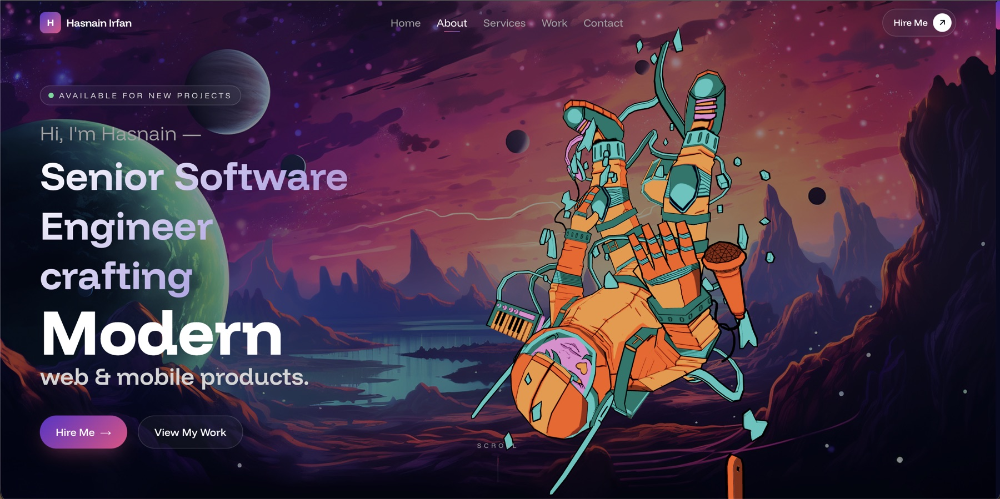

<div align="center">

# 3D Developer Portfolio — Next.js 16 · React Three Fiber · Three.js · Tailwind CSS v4

**An interactive, animated 3D portfolio website for developers** — a GLTF astronaut floating in a WebGL canvas, a GPU shader globe that flies down the page as you scroll, magnetized particles, scroll-driven motion, a working contact form and a private admin inbox. Built with Next.js 16 (App Router), React 19, TypeScript, Three.js and Tailwind CSS v4.

[**Live Demo →**](https://hasnaindeveloper.vercel.app)

[](https://nextjs.org)
[](https://react.dev)
[](https://threejs.org)
[](https://r3f.docs.pmnd.rs)
[](https://www.typescriptlang.org)
[](https://tailwindcss.com)
[](LICENSE)

<br />

[](https://hasnaindeveloper.vercel.app)

<sub><i>The hero section — a GLTF astronaut floating over parallax alien terrain. The shader globe takes over as you scroll.</i></sub>

</div>

---

## Table of contents

- [What this is](#what-this-is)
- [Features](#features)
- [Where your leads go](#where-your-leads-go)
- [Tech stack](#tech-stack)
- [Quick start](#quick-start)
- [Environment variables](#environment-variables)
- [Project structure](#project-structure)
- [Make it your own](#make-it-your-own)
- [Deployment](#deployment)
- [Performance notes](#performance-notes)
- [Documentation](#documentation)
- [Credits & asset licensing](#credits--asset-licensing)
- [License](#license)

---

## What this is

A production portfolio site, not a demo. It is the code behind
[hasnaindeveloper.vercel.app](https://hasnaindeveloper.vercel.app) — the personal
site of **Hasnain Irfan**, a software engineer building web and mobile products
with React, Next.js, React Native and Node.js.

It is also a **reusable 3D portfolio template**. Every piece of copy — name,
role, projects, services, experience, testimonials, skills, socials — lives in a
single typed constants file, so you can fork this repo and have your own site
running without touching a component. See [Make it your own](#make-it-your-own).

**It captures leads, not just impressions.** Every contact-form enquiry is saved
to your own database *and* emailed to you, and you read them in a private admin
inbox at `/admin` — no third-party form service, no monthly fee, no one else
holding your leads. See [Where your leads go](#where-your-leads-go).

## Features

**3D & WebGL**
- **Floating astronaut** — a GLTF/GLB model animated with `useGLTF` + `useAnimations`, mouse-reactive camera rig with damped easing, and a spring-driven entrance.
- **Shader globe** — 3,000 capsules instanced onto a Fibonacci sphere in **one draw call**, with four orbiting orbs that carve travelling craters into the surface via inverse-square displacement computed entirely in the vertex shader. Analytic fresnel glass, an aqua rim light and a bloom pass from [`postprocessing`](https://github.com/pmndrs/postprocessing).
- **A globe that flies down the page** — one keyframe per section, joined by a Catmull-Rom spline and chased by critically damped springs, so the globe travels with your scroll instead of cutting between positions.
- **Mouse-magnetized particle field** — a 2D canvas layer behind the contact section whose particles drift, fade and lean toward the cursor.
- **Mobile-aware scenes** — the 3D canvas rescales and repositions below 853px so the astronaut never fights the copy for space.
- A drop-in [COBE](https://cobe.vercel.app) marker globe (`components/portfolio/globe.tsx` + `constants/globe-constants.ts`) also ships with the repo if you want the lighter, cheaper option.

**Motion & UI**
- Scroll-driven section reveals and layout transitions with [Motion](https://motion.dev) (Framer Motion's successor).
- Parallax mountain/sky background layers that respond to pointer movement.
- Flip-word headline, marquee logo strip, orbiting-circles skill cloud, animated vertical experience timeline.
- Project cards with a detail modal, copy-to-clipboard email button, and toast alerts.
- A full-screen page loader that hides the layout shift while the WebGL scenes warm up.
- Responsive from 320px up, keyboard-navigable, with `prefers-color-scheme`-aware browser chrome theming.

**Backend & content**
- **Contact form** → validated Route Handler that persists the enquiry to Supabase. Email is sent afterwards by a Supabase Edge Function, so no mail library or credential is in the web app.
- **Private admin inbox at `/admin`** — **Supabase Auth** for sign-in, plus an `admin_users` allowlist for authorisation, because "signed in" and "allowed to read strangers' contact details" are not the same question. Enforced in `proxy.ts`, again in the page and every Server Action, and again by row-level security.
- **Zero secrets.** No admin password, no session signing key, no service-role key, no SMTP credentials — the entire deployment is two `NEXT_PUBLIC_` values, and RLS does the enforcing.
- **Degrades instead of erroring.** With an empty `.env` the site builds and runs; `/admin` shows a setup panel and the contact form points visitors at your email address. No stack traces, no red console.
- **SEO ready** — typed `metadata` with keywords and Open Graph tags, a Web App Manifest, and dynamically generated `icon` / `apple-icon` routes.

## Where your leads go

A portfolio's job is to turn a visitor into a conversation. This one keeps that
whole path in your hands.

```
Visitor fills in the contact form
        │
        ▼
POST /api/contact           validates every field, then writes one row
        │                   (anon key, INSERT-only under RLS)
        ▼
contact_submissions         the lead is now safe
        │
        ├──▶ Database Webhook ─▶ notify-contact Edge Function ─▶ your SMTP
        │                          (credentials live in Supabase)
        │
        ▼
Read it at  /admin          your private inbox — search, page, delete
```

**The row is written first, and the email is a consequence of it.** That
ordering is deliberate: a bounced SMTP password costs you a notification, never
the lead itself. The Edge Function writes its result back to the row, so a
failed send shows up in `/admin` as a warning instead of disappearing.

**Nothing in this repo can send email.** The SMTP credentials are Supabase
secrets, set once with `supabase secrets set`. Clone the repo and you have
nothing to leak.

### The `/admin` inbox

Sign in at **`/admin/login`** with a Supabase Auth account. Being signed in is
only half of it — reading the inbox needs a row in `public.admin_users`, which
can only be written from the SQL editor:

```sql
select public.grant_admin('you@example.com');
```

That separation is the point. A Supabase project can accumulate accounts you
never intended to give access to; without an allowlist, every one of them could
read your visitors' names, email addresses and IPs.

Once inside, `/admin` gives you:

| Feature | What it shows |
| --- | --- |
| **Two counters** | Total enquiries, and how many arrived in the last 7 days |
| **The full list** | Newest first, 25 per page |
| **Per enquiry** | Name, email, budget, the message, when it arrived, the visitor's user agent and IP, and whether the notification email actually sent |
| **Search** | Across name, email and message |
| **Delete** | Remove a submission when you're done with it |

Security, briefly — the detail is in [`docs/admin.md`](docs/admin.md):

- Gated three times: `proxy.ts` before a page renders, `getAdminState()` inside
  the page and every Server Action, and the RLS policy in the database. Server
  Actions are reachable by direct POST, so the second check is doing real work.
- Sessions, password hashing, refresh-token rotation and sign-in rate limiting
  are Supabase Auth's job, not this codebase's.
- **No service-role key exists in this project.** Every query runs as whoever
  made the request, so RLS is the actual enforcement rather than a second
  opinion on top of a privileged client that bypasses it.
- `anon` may INSERT into `contact_submissions` and nothing else — a visitor
  cannot read back even the row they just wrote.
- `admin_users` has no insert, update or delete policy at all. Nothing the app
  can be tricked into doing will create an admin.
- The page is `noindex, nofollow` — it lists real people's contact details.

**Don't want any of this?** The site runs perfectly with zero environment
variables — point the form at a `mailto:` link and delete the backend. The
teardown is one paragraph in [`docs/customization.md`](docs/customization.md#6-trimming-what-you-dont-need).

## Tech stack

| Layer | Choice |
| --- | --- |
| Framework | [Next.js 16](https://nextjs.org) — App Router, Route Handlers, Server Actions |
| Language | TypeScript 5 (strict) |
| UI | React 19 |
| 3D | [Three.js](https://threejs.org) r184, [React Three Fiber](https://r3f.docs.pmnd.rs) 9, [`@react-three/drei`](https://github.com/pmndrs/drei) 10, [`maath`](https://github.com/pmndrs/maath), [`postprocessing`](https://github.com/pmndrs/postprocessing) |
| Globe | Custom instanced-mesh GLSL shader globe (+ optional [COBE](https://cobe.vercel.app) alternative) |
| Animation | [Motion](https://motion.dev) 12 |
| Styling | [Tailwind CSS v4](https://tailwindcss.com) (CSS-first `@theme` config), `tailwind-merge` |
| Database | [Supabase](https://supabase.com) — Postgres, row-level security |
| Auth | [Supabase Auth](https://supabase.com/docs/guides/auth) via [`@supabase/ssr`](https://github.com/supabase/auth-js) |
| Email | Supabase Edge Function (Deno) over SMTP — credentials held in Supabase |
| Fonts | `next/font` — Funnel Display, self-hosted and preloaded |
| Hosting | [Vercel](https://vercel.com) |

## Quick start

**Requirements:** Node.js **20.9+** (Next 16's minimum) and npm.

```bash
git clone https://github.com/HasnainIrfan/myportfolio.git
cd myportfolio
npm install
cp .env.example .env      # then fill in the values you need
npm run dev
```

Open <http://localhost:3000>.

The site renders with **no environment variables at all** — the two in
`.env.example` are only needed for the contact form and `/admin`, and their
absence is a supported state, not an error. If you just want the front end, skip
straight to [Make it your own](#make-it-your-own).

| Script | Does |
| --- | --- |
| `npm run dev` | Dev server with hot reload |
| `npm run build` | Production build |
| `npm run start` | Serve the production build |
| `npm run lint` | ESLint (`eslint-config-next`) |

## Environment variables

Copy [`.env.example`](.env.example) to `.env`. There are two, both public, and
**both optional**:

| Variable | Purpose |
| --- | --- |
| `NEXT_PUBLIC_SUPABASE_URL` | Supabase project URL |
| `NEXT_PUBLIC_SUPABASE_ANON_KEY` | Supabase anon key |

That is the entire list. No admin password, no session signing key, no
service-role key, no SMTP credentials — **this project has no server-only
secrets at all.**

The anon key is not a secret; it identifies the project, and [row-level
security](supabase/migrations/0002_admin_auth.sql) decides what it can reach.
Shipping it to the browser is the intended design.

With neither set, the site builds and runs: `/admin` shows a setup panel and the
contact form asks visitors to email you directly. Nothing throws.

**SMTP credentials** are Supabase secrets, not deployment variables:

```bash
supabase secrets set SMTP_HOST=... SMTP_USER=... SMTP_PASS=... \
                     CONTACT_RECIPIENT_EMAIL=... \
                     NOTIFY_WEBHOOK_SECRET="$(openssl rand -hex 32)"
```

Full walkthrough in [`docs/admin.md`](docs/admin.md).

## Project structure

```
app/
  layout.tsx              Root layout, fonts, SEO metadata, viewport theming
  page.tsx                Renders <HomePage />
  globals.css             Tailwind v4 @theme tokens + keyframes
  manifest.ts             Web App Manifest
  icon.tsx apple-icon.tsx Dynamically generated favicons
  admin/                  Protected inbox: page, layout, server actions
    login/                Sign-in page, form, and the auth Server Actions
  api/
    contact/route.ts      Validate → persist one row to Supabase
components/
  admin/                  Setup panel shown when Supabase is not connected
  portfolio/              Reusable pieces: astronaut, themed-globe (shader),
                          globe (COBE), particles, timeline, marquee,
                          orbiting-circles, project-card, project-details,
                          flip-words, loader, page-loader, alert,
                          parallax-background, copy-email-button, frameworks
  sections/               Page sections: navbar, hero, about, services,
                          projects, experiences, testimonial, contact, footer
constants/
  portfolio-constants.ts  ← ALL site copy and data lives here
  globe-constants.ts      COBE config and marker coordinates
helpers/particles-helpers.ts
lib/
  supabase/               config (is it connected?) · request-scoped client
  admin/                  auth (signed in? admin?) · data (queries)
proxy.ts                  Next 16's renamed middleware — refreshes the Supabase
                          session and gates every /admin request
types/portfolio-types.ts  Shared types for every constant above
supabase/
  migrations/             0001 table · 0002 admin model + RLS · 0003 seed admin
  functions/              notify-contact — Edge Function that emails you a lead
  templates/              Dark-themed Supabase Auth emails (reset, invite, …)
  config.toml             CLI config, wires the templates up
docs/                     Architecture, customization, deployment, admin
public/
  models/                 GLB 3D model (~3 MB)
  assets/                 Images, project shots, tech logos, social icons
```

## Make it your own

Fork it, then work through these four steps. Steps 1–3 need no component edits.

**1. Replace the content.** Open `constants/portfolio-constants.ts` — it holds
`HERO_NAME`, `HERO_ROLE`, `HERO_LOCATION`, `HERO_TAGLINE`, `STATS`,
`MY_PROJECTS`, `SERVICES`, `EXPERIENCES`, `REVIEWS`, `MY_SOCIALS`,
`FRAMEWORK_SKILLS`, `SKILL_CHIPS`, `FLIP_WORDS` and `CONTACT_EMAIL`. Every entry
is typed against `types/portfolio-types.ts`, so TypeScript tells you the moment
a field is missing.

**2. Swap the images.** Drop project screenshots into `public/assets/projects/`
and tech logos into `public/assets/logos/`, then point the `image` / `path`
fields at them.

**3. Recolor.** The palette is a Tailwind v4 `@theme` block at the top of
`app/globals.css` — change `--color-royal`, `--color-aqua`, `--color-lavender`
and friends and the whole site follows, including the gradients and the browser
chrome tint in `app/layout.tsx`.

**4. Update the SEO.** `app/layout.tsx` (`title`, `description`, `keywords`,
`authors`, `openGraph`) and `app/manifest.ts`.

**Changing the 3D model?** Put your `.glb` in `public/models/`, update the path
in `components/portfolio/astronaut.tsx`, and adjust `scale` / `position` in
`components/sections/hero.tsx`. Full walkthrough in
[`docs/customization.md`](docs/customization.md).

## Deployment

Deploys to Vercel with zero configuration — import the repo and ship; there are
no required environment variables. Add the two Supabase values when you want the
contact form and inbox. The 3D scenes are client-only
(`dynamic(..., { ssr: false })`), so any Node 20.9+ host works too. Step-by-step,
including the migrations and the Edge Function:
[`docs/deployment.md`](docs/deployment.md).

## Performance notes

- Hero and globe are dynamically imported with `ssr: false` — no WebGL runs during SSR, and the JS lands in separate chunks.
- The globe is one instanced draw call for 3,000 spikes; displacement, lighting and colour all happen on the GPU, so scroll stays on the main thread's good side.
- A page loader covers the first paint so the layout never jumps as the canvases mount.
- Fonts go through `next/font` (self-hosted, preloaded, zero layout shift).
- The GLB model is ~3 MB and the background plates are large PNGs — the biggest win available if you fork this is re-exporting the model with [Draco compression](https://github.com/google/draco) and converting `public/assets/*.png` to WebP/AVIF.
- `useMediaQuery` downscales the 3D scene on small screens instead of rendering the desktop scene and cropping it.

## Documentation

| Doc | Covers |
| --- | --- |
| [`docs/architecture.md`](docs/architecture.md) | How the render pipeline, stacking contexts, data flow and 3D layer fit together |
| [`docs/customization.md`](docs/customization.md) | Rebranding it as your own portfolio, end to end |
| [`docs/deployment.md`](docs/deployment.md) | Vercel + Supabase setup, Edge Function deploy, production checklist |
| [`docs/admin.md`](docs/admin.md) | The `/admin` inbox: the Supabase Auth model, migrations, lead emails |
| [`CONTRIBUTING.md`](CONTRIBUTING.md) | Conventions, PR flow, what's in scope |

## Credits & asset licensing

The **code** is MIT licensed. The **content and assets are not** — please swap
them for your own before deploying:

- **Personal content** — name, biography, project write-ups, testimonials, experience and the résumé PDF belong to Hasnain Irfan. Replace them; don't republish them as your own.
- **3D model** — `public/models/tenhun_falling_spaceman_fanart.glb` is third-party fan art sourced from Sketchfab. **Check its original license and keep the required attribution** before you use it in your own deployment.
- **Project screenshots and client logos** belong to their respective owners.
- The shader globe is a retheme of a public React Three Fiber demo — see the header comment in `components/portfolio/themed-globe.tsx` for what changed and why.
- 3D helpers by the [pmndrs](https://github.com/pmndrs) ecosystem, animation by [Motion](https://motion.dev), marker globe by [COBE](https://cobe.vercel.app).

If this repo helped you build your own portfolio, a ⭐ is very welcome.

## License

[MIT](LICENSE) © Hasnain Irfan — code only. See
[Credits & asset licensing](#credits--asset-licensing) for the content and
assets.
